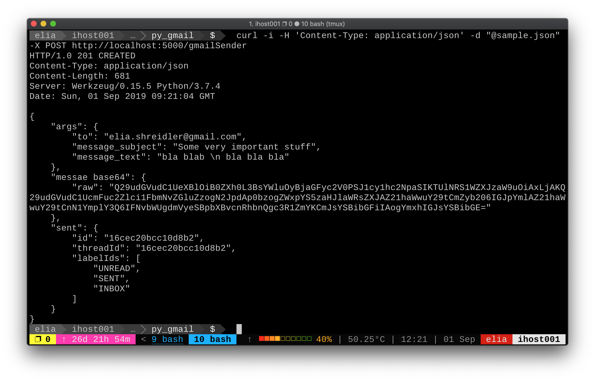

# python gmail REST API
A small module that allows the sending of emails via REST api,
nicely packed into a docker container.

# How To

Start API using Docker and gunicorn

0. get `json credentials` file from google API,
for more info: https://developers.google.com/gmail/api/quickstart/python
save the file as: `credentials/credentials.json`
1. build the docker image:

    `docker build -t gmail_rest_api ./`
2. start docker container -

    `docker run -d -p 80:80 -e MODULE_NAME="flask_service" myimage`
3. curl away -

    `curl -ki -H 'Content-Type: application/json' -d "@sample.json" -X POST http://localhost:80/gmailSender`
